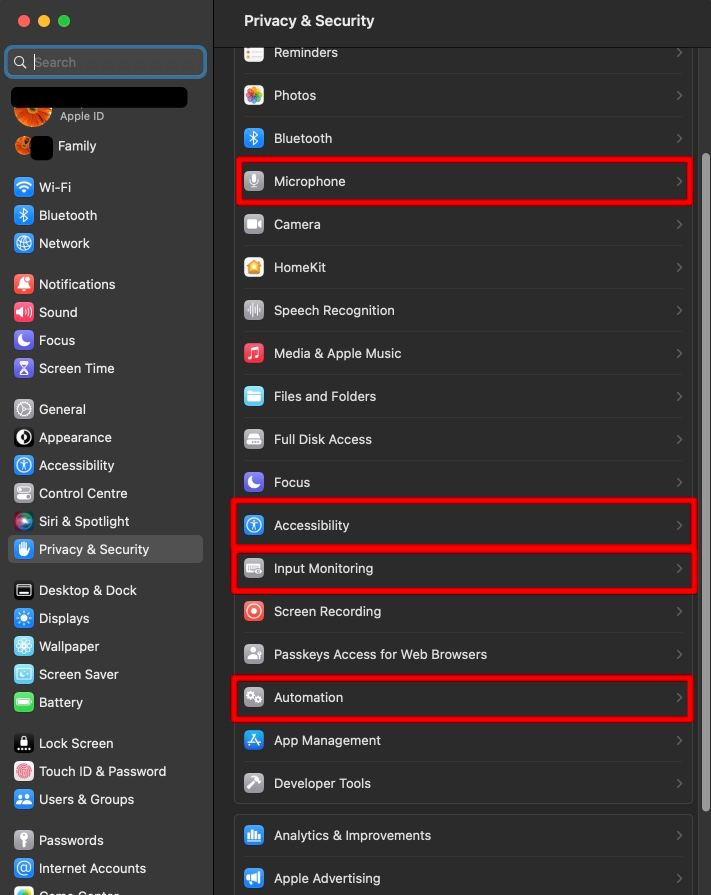
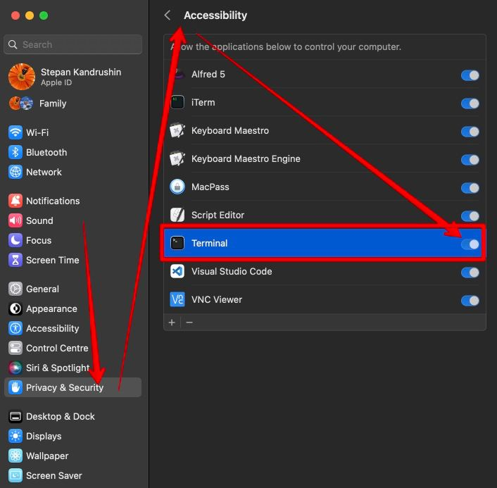

# voice-typing

Dictation app for voice typing using private whisper or any other transcription server

  

## Installation

```
# In Mac OS open Terminal and install HomeBrew, git and python3 (if was not installed before):
/bin/bash -c "$(curl -fsSL https://raw.githubusercontent.com/Homebrew/install/HEAD/install.sh)"
brew install git
brew install python3

# In linux needed to Pyperclip module works:
sudo apt-get install -y xclip python3 python3-pip

# copy project
git clone https://github.com/bsnjoy/voice-typing.git

cd voice-typing
python3 -m pip install -r requirements.txt
cp config.py.sample config.py

# Print devices with microphone and their names to use in config file (only need for custom microphones):
python3 list_devices.py

# edit config using your preferred editor:
vim config.py

# Start application (It also restarts the app if it was running before)
./start.sh

```

In Mac OS after running you will need to allow your application to monitor key strokes from another apps, access to Microphone, access to control other apps (to paste data), to do this after application was started:

### Allow access to monitor Hotkeys
1. Choose Apple menu  > System Settings, then click **Privacy & Security**
2. Click on the right: **Input Monitoring**
3. Turn on the setting for Terminal app.

### Allow access to Microphone
1. Choose Apple menu  > System Settings, then click **Privacy & Security**
2. Click on the right: **Microphone**
3. Turn on the setting for Terminal app. (If you don't see Terminal, start the application ./start.sh and press your hotkey to activate querry to microphone)

### Allow access to Accessibility
1. Choose Apple menu  > System Settings, then click **Privacy & Security**
2. Click on the right: **Accessibility**
3. Turn on the setting for Terminal app.

### Allow access to Automation
1. Choose Apple menu  > System Settings, then click **Privacy & Security**
2. Click on the right: **Automation**
3. Turn on the setting **System Events** for Terminal app.

### Screenshots for options above
You need to approve Terminal app in all 4 sections: 

 
Example of approving Terminal app in Accessibility section:  



## Update application
```
# Stop appincation using Ctrl+C
git pull
# Read in update.txt for possible updates needed to be made for config.py
# Start the application:
./start.sh
```